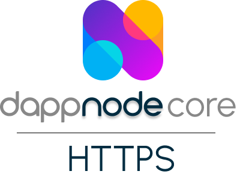

# HTTPS

This is a fork of an original [https-portal](https://github.com/SteveLTN/https-portal), with additional features intended to be used in [DAppNode](https://github.com/dappnode/DAppNode) as one of the core packages. All of its existing features should remain functional.

<p align="center"><a href="#"></a></p>

## Configurable forwarding

API was added through which containers proxied through portal can be dynamically chosen. By default the server listens at port `5000` for `GET` methods `add` and `remove` both of which have `to` and `from` query parameters i.e.

```
GET /add?from=<chosen-subodomain>&to=<internal-resource>
GET /remove?from=<chosen-subodomain>&to=<internal-resource>
```

Where `chosen-subdomain` is the chosen external endpoint for forwarding and `internal-resource` is either the IP or domain that resolves on the internal network.

## DAppNode certificates

When using the DAppNode dyndns service, https-portal uses DAppNode's certificate service to get wildcard certificates for the DAppNode dyndns domains which are provided for free. In this mode, the following environment variables have to be set:
| Name | Value | Description |
| -------------- | --------------------- | ----------------------------- |
| CERTAPI_URL | TBD | URL of remote signing service |

This mode can only be used within DAppNode as a package.

## Running DAppNode on your own domain

It is even possible to run DAppNode on your own domain. Your domain and all of its subdomains should resolve to the pubilc IP of the DAppNode. But please note, for every subdomain certificate is requested since it uses HTTP challenges which cannot be used for issuing wildcard certificates.
In this mode, the following environment variables have to be set:
| Name | Value | Description |
| -------------- | --------------------- | ------------------ |
| PUBLIC_DOMAIN | | Your domain |
